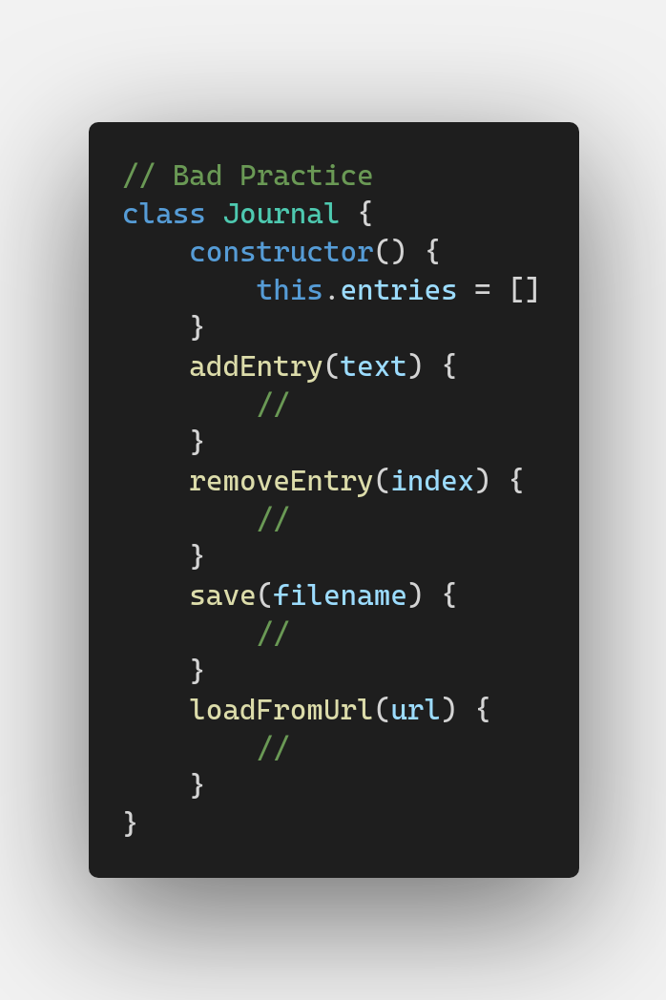
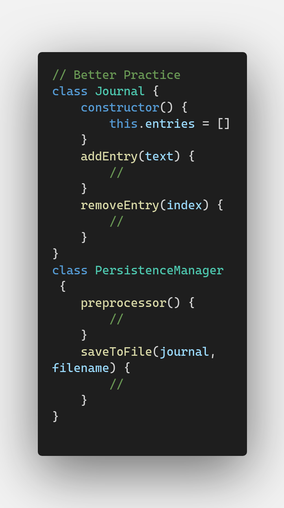

# Solid Design Principal
---
---

## Single Responsibility Principle
---

**Single responsibility principle** is a simple principle, and it tells us that a class should have single primary responsibility and as a consequence it should only have one reason to change, That reason being somehow related to its responsibility in other words it's a bat idea to add more than one responsibility to a class.

<!--bad code example img-->
<!--  -->
```
// Bad Practice
class Journal {
    constructor() {
        this.entries = []
    }
    addEntry(text) {
        //
    }
    removeEntry(index) {
        //
    }
    save(filename) {
        //
    }
    loadFromUrl(url) {
        //
    }
}
```

In the above code we made a journal that is going to keep record. While the bat practice signifies that you add a lot of code and give a multiple responsibility for singel class for journal management as well as file handeling . 

<!--better code example img-->
<!--  -->
```
// Better Practice
class Journal {
    constructor() {
        this.entries = []
    }
    addEntry(text) {
        //
    }
    removeEntry(index) {
        //
    }
}
class PersistenceManager {
    preprocessor() {
        //
    }
    saveToFile(journal, filename) {
        //
    }
}
```
In the above example it can be seen that it is easy to understand and implement the code by grouping the functionalities by the class instead of sticking all the functionality into a single class

In actual fact there is an anti-pattern that shows up during a coding practice which is rather bad as opposed to a good. There is also a pattern called a god object pattern which is huge massive class that has lots of responsibility and spaghetti code which is very difficult to figure out

And so the single responsibility is the exact opposite that basically lets us have just one responsibility and if we need additional responsibility then we just make other class as they don't cost us anything. 

Another term we used is called separation of concerns. So separation of concern is what we do when we refactor for example so let's suppose you find a really complicated algorithm and what we are trying to do is split it into a diffrent parts which are somehow related. 

Seperation of the concern is also widely used one of most popular JS libary reactjs. So in React, we solved this issue by creating container components that contain all the logic, which would then pass down the data via props to the presentational component. And with the introduction of React hooks, there's a new approach to this: using custom hooks. 

The code is available to preview on *"singleResponsibilityPrincipale.js"*

